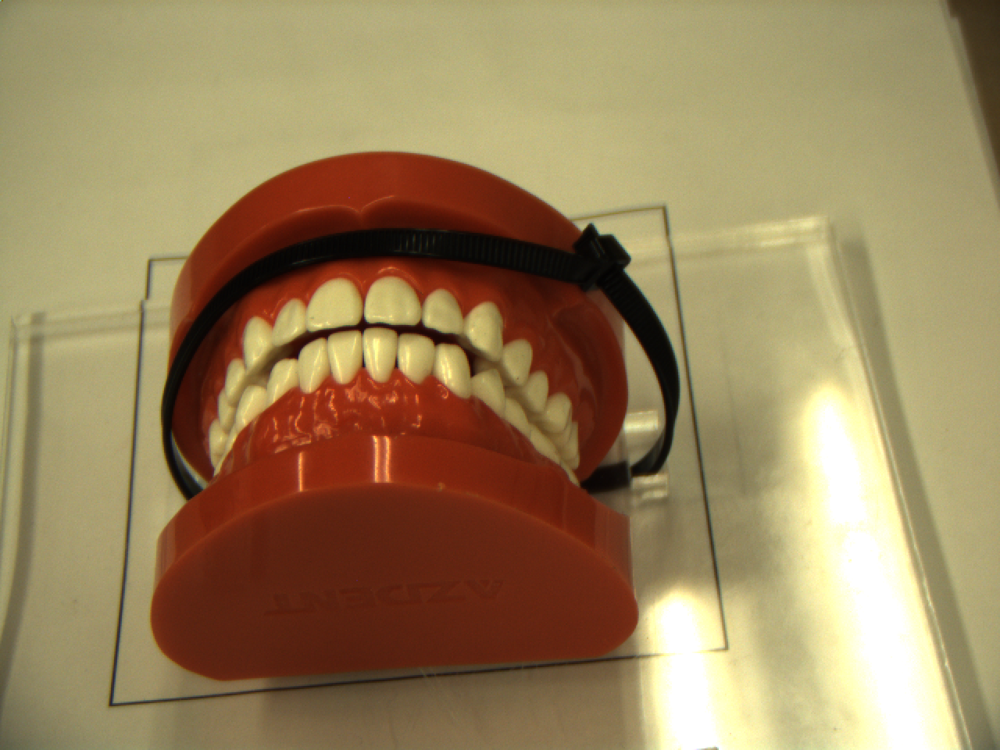

# AutonomousDentalCleaning
This project is a part of independent study taken towards completion of Masters in Robotics at University of Maryland. 

# Running a Demo

#### On DataSet Images
1. Execute the script ```PlaqueDetect.m```. The algorithm will run and generate a coverage map and also show a proposed cleaning time. It is set to run on a single image. But ```i``` on line 4 can be made to iterate on the images in the dataset. ```i``` goes from 45 to 90.

#### On Real life image


The code in MATLAB is written to generate the gumline points offline and then these points can be dumped to a .txt file which can be read by a ROS node to command the KUKA iiwa manipulator to trace these points, after conversion through homography calculation. From MATLAB perspective, following steps should be followed to get the teeth points on the gumline. 

1. Put the teeth on the acrylic base under the camera such that the corner points of the acrylic base are visible. **IMPORTANT:** Save the image using OpenCV ```imwrite``` when using the gscam package to get the stream of images from the FLEA camera. The image saved normally gets saved in the .ros folder. 

2. The image saved in the last step should be used in MATLAB to process and get the gumline points.

3. ```RealTeethGetGumlinePoints.m``` is the file that should be executed and this will generate a set of points on the gumline of the upper teeth and the lower teeth. ```upper_teeth_points_orig``` and the ```lower_teeth_points_orig``` are the two list that will give these points on the image saved in step 1 in pixel co-ordinates.

4. Before you execute ```RealTeethGetGumLinePoints.m```, you should take care of couple of things. First, replace the base_image.png file with the one you saved in Step 1. Second, you need to put correct values in the ```square_clock``` variable in the ```RealTeethGetGumLinePoints.m```as per your setting. These points are in the clockwise manner in pixel co-ordinates starting from top left. Once these are set, you can execute the script.

5. ```dump_points_to_file.m``` is a utility script that will write the gumline points in the order that is expected.

## Acknowledgements
1. [Labial Teeth and Gingiva Image Database, Eckhard et al.;Labial teeth and gingiva color image segmentation for gingival health-state assessment; IS&T/ 6th European Conference on Color in Graphics, Imaging and Vision, CGIV 2012, pp. 102-107, Amsterdam (Netherlands); 2012][1]

2. [vlfeat library for MSER detection](http://www.vlfeat.org/index.html)


[1]: http://www.ugr.es/~colorimg/LTG_image_database.html


